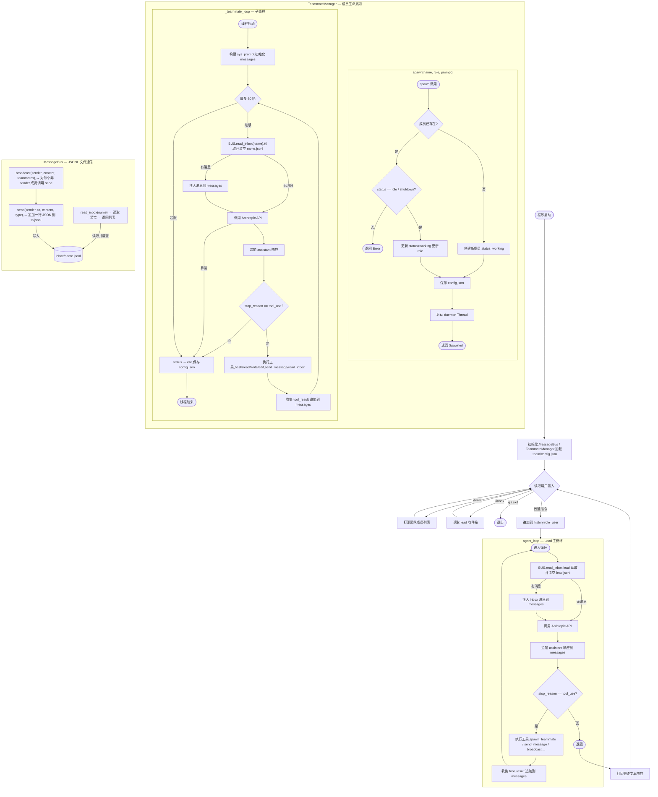

## s09_agent_teams 软件流程图

### 关键设计要点

| 概念 | 说明 |
|------|------|
| **MessageBus** | 纯文件 JSONL，append 写入、读后清空，天然解耦发送方与接收方 |
| **TeammateManager** | 维护 config.json 状态机，spawn 复用已有成员或新建，每人独立 daemon 线程 |
| **状态机** | 成员状态：`working → idle → working`（可复用）或 `shutdown`（s10 扩展） |
| **Lead 主循环** | 单线程 REPL，每轮先检查自己的收件箱，再调用 API |
| **Teammate 子线程** | 每个成员独立 daemon 线程，最多 50 轮对话后自动变 idle |
| **消息类型** | 5 种类型在此文件声明，`shutdown_*` 和 `plan_approval_response` 留给 s10 实现 |
