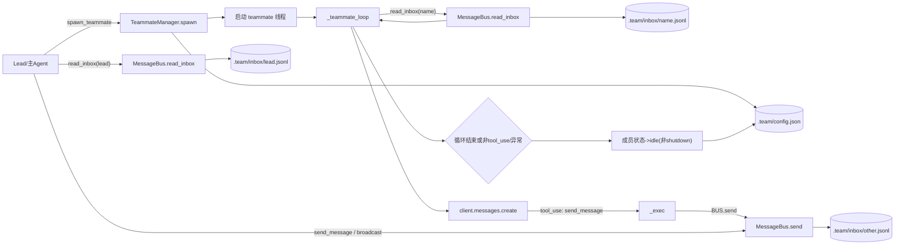

# s09 Agent Teams 组合流程图

本文档描述 `TeammateManager` 与 `MessageBus` 在 `agents/s09_agent_teams.py` 中的协作流程。

## 关键说明

- `TeammateManager` 负责队友生命周期（创建线程、状态维护、配置落盘）。
- `MessageBus` 负责消息投递与收件箱读取（读取后即清空，属于 drain 语义）。
- Lead 与 Teammate 都通过 `MessageBus` 间接通信，不直接共享会话上下文。
